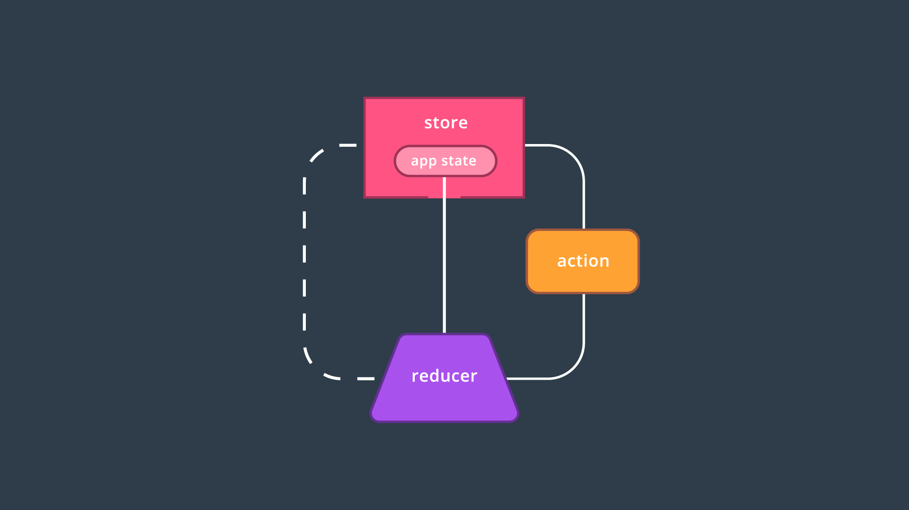

# Introduction to Redux

In the previous Lesson, you got a high-level overview of Redux. In this Lesson, we’ll learn the fundamentals of Redux including actions, action creators, reducers, and the store.

[video](https://youtu.be/t_q18xa5loo)

The reason Redux is difficult to learn is because in order to build anything worthwhile, you need to understand how all of the pieces fit together at the same time. Try your best to understand how each new topic we cover fits into the Redux ecosystem, so that when it does come time to put the pieces together, you’ll be ready.

[Video](https://youtu.be/NZznIjRnCt4)

*All Redux elements are interconnected, with the store being the central element.*

This is the graphic we just looked at. As you can see, there are three main parts to Redux:

- Actions
- Reducers
- The store

Most of the application's data or state lives in the store. The store's data is populated by reducers (there can be more than one reducer, but we're only showing one in the image). An action is "dispatched" by the store and is what's used by reducers to determine what data they should output. For clarity, there also can (and will be!) more than just one action in a Redux application.

*The flow of data in a Redux app. The store dispatches an action to its reducer. The reducer processes the current state with the action, returning the new state of the application.*

Just like React, Redux believes in unidirectional data flow. What that means is that data only ever flows one way through the application.
## Summary
The whole goal of Redux is to make state management in your application more manageable. Typically, you use Redux in combination with React. However, they don't have to be used together. Redux can really be used in any application that needs help managing state.

The main concepts of Redux are **actions**, **reducers**, and the **store**. The store is the source of truth for the state in your application, reducers specify the shape of and update the store, and actions are payloads of information which tell reducers which type of events have occurred in the application.