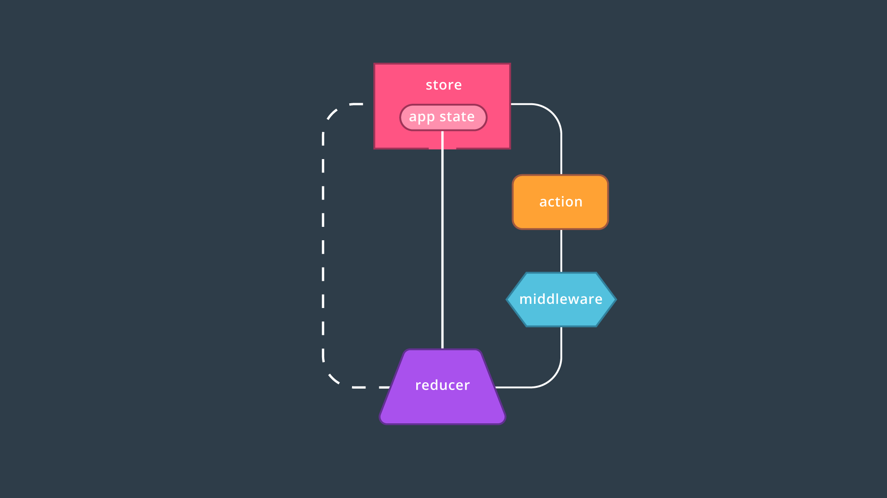

# What is Middleware?

[video](https://youtu.be/WMK2mLNfU8E)

*As the Redux docs describe, middleware is a third-party extension point between dispatching an action and the moment it reaches the reducer.*

## Middleware and Redux

We've learned how the unidiretional flow of data supports predictability in Redux applications: in order to change the store's state, an `action` describing that change must be `dispatch`ed to the `reducer`.  In turn the `reducer` returns the new `state`.

Between the dispatching of actions and the reducer, we can introduce middleware to intercept the action before it ever reaches the reducer.  As the [Redux docs](http://redux.js.org/docs/advanced/Middleware.html) describe it, you can think of middleware as:

> ...a third-party extension point between dispatching an action and the moment it reaches the reducer.

Once middleware receives the action, it can then carry out a number of operations, including:

* Producing a side effect (e.g., [logging state](https://github.com/evgenyrodionov/redux-logger))
* Processing the action on its own (e.g., making an asynchronous HTTP request)
* Redirecting the action (e.g., to another piece of middleware)
* Running some code during the dispatch
* Dispatching supplementary actions

...and it can do any of this *before* passing the action along to the reducer!

### Quiz Question
What is true about middleware?  (check all that apply)

* [x] Middleware in Redux picks up a dispatched action *before* it reaces the reducer.
* [ ] Middleware is exclusive to Redux apps.
* [x] Middleware can help make asynchronous HTTP requests.
* [ ] Using an enhancer like middleware allows you to create a Redux store without a reducer.

## Middleware Recap
Middleware can be implemented within the same unidirectional pattern of state management that Redux follows. In particular, middleware can intercept dispatched actions before they ever reach the reducer, then follow up by redirecting the action or producing a side effect.

We'll jump into one particular side effect in the next section when we use **logger** middleware to print valuable information to the console.

### Further Research

* [Middleware from the Redux docs](http://redux.js.org/docs/advanced/Middleware.html)
* [Creating custom Middleware in React/Redux](https://medium.com/@jihdeh/creating-custom-middleware-in-react-redux-961570459ecb)